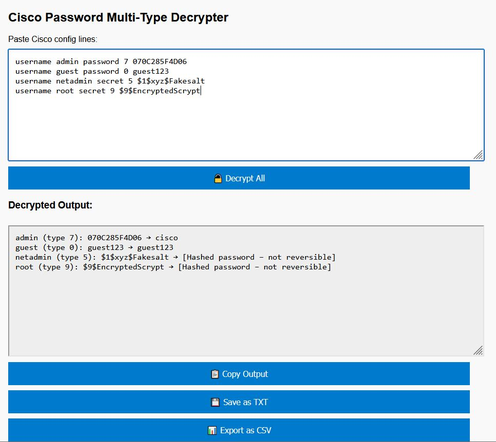

# Cisco Password Multi-Type Decrypter

A simple web-based tool for analyzing and decoding Cisco password lines from configuration files. It supports multiple password types and allows exporting results for further analysis.

## 🔍 Features

- ✅ Support for Cisco password types:
  - **Type 0**: Plaintext
  - **Type 7**: Reversible encryption (can be decrypted)
  - **Types 5, 8, 9**: Hashed (non-reversible)
- ✅ Parses full Cisco config lines:
  - `username admin password 7 070C285F4D06`
  - `enable secret 9 $9$encrypted`
- ✅ Decrypts all Type 7 passwords
- ✅ Displays all other password types with appropriate notes
- ✅ Extracts and lists username, password type, encrypted, and decrypted values
- ✅ Export to CSV and TXT
- ✅ Copy results to clipboard

## 🚀 How to Use

1. **Open the HTML file** in a browser (no server required).
2. **Paste Cisco configuration lines** (e.g., usernames, secrets) into the input box.
3. Click **"🔓 Decrypt All"**.
4. Review the results in the output section.
5. Use:
   - **📋 Copy Output**: Copies the results to clipboard
   - **💾 Save as TXT**: Downloads a plain text file with the results
   - **📊 Export as CSV**: Downloads a CSV with username, type, encrypted and decrypted columns

## 📦 Example Input
```
username admin password 7 070C285F4D06
username guest password 0 guest123
enable secret 5 $1$xyz$abcdefg123
enable secret 9 $9$examplehash
```
## 🖼️ Screenshots



## 🛡 Notes
- Type 7 is the only reversible encoding. All others are cryptographic hashes.
- This tool does not attempt brute force or dictionary attacks for Type 5/8/9.
- Works completely offline – no data is sent anywhere.

## 📁 Files Included
- `index.html`: The main tool (open this in your browser)
- `README.md`: This documentation

---
Made for educational and administrative auditing purposes. Use responsibly.
